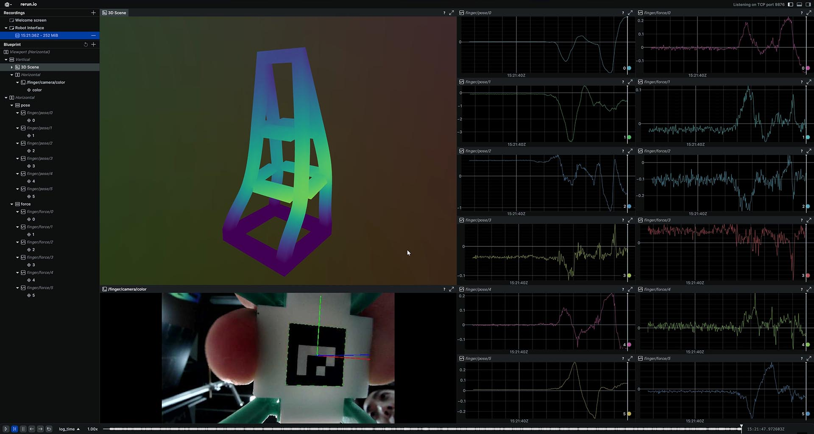

# MetaFinger Viewer

[](LICENSE) [](https://www.python.org) [![Rerun](https://img.shields.io/badge/rerun-0.20.0-black?style=flat-square&logo=data:image/svg+xml;charset=utf-8;base64,PHN2ZyB3aWR0aD0iMTYiIGhlaWdodD0iMTYiIHZpZXdCb3g9IjAgMCAxNiAxNiIgZmlsbD0ibm9uZSIgeG1sbnM9Imh0dHA6Ly93d3cudzMub3JnLzIwMDAvc3ZnIj4KPGcgY2xpcC1wYXRoPSJ1cmwoI2NsaXAwXzQ0MV8xMTAzOCkiPgo8cmVjdCB3aWR0aD0iMTYiIGhlaWdodD0iMTYiIHJ4PSI4IiBmaWxsPSJibGFjayIvPgo8cGF0aCBkPSJNMy41OTcwMSA1Ljg5NTM0TDkuNTQyOTEgMi41MjM1OUw4Ljg3ODg2IDIuMTQ3MDVMMi45MzMgNS41MTg3NUwyLjkzMjk1IDExLjI5TDMuNTk2NDIgMTEuNjY2MkwzLjU5NzAxIDUuODk1MzRaTTUuMDExMjkgNi42OTc1NEw5LjU0NTc1IDQuMTI2MDlMOS41NDU4NCA0Ljk3NzA3TDUuNzYxNDMgNy4xMjI5OVYxMi44OTM4SDcuMDg5MzZMNi40MjU1MSAxMi41MTczVjExLjY2Nkw4LjU5MDY4IDEyLjg5MzhIOS45MTc5NUw2LjQyNTQxIDEwLjkxMzNWMTAuMDYyMUwxMS40MTkyIDEyLjg5MzhIMTIuNzQ2M0wxMC41ODQ5IDExLjY2ODJMMTMuMDM4MyAxMC4yNzY3VjQuNTA1NTlMMTIuMzc0OCA0LjEyOTQ0TDEyLjM3NDMgOS45MDAyOEw5LjkyMDkyIDExLjI5MTVMOS4xNzA0IDEwLjg2NTlMMTEuNjI0IDkuNDc0NTRWMy43MDM2OUwxMC45NjAyIDMuMzI3MjRMMTAuOTYwMSA5LjA5ODA2TDguNTA2MyAxMC40ODk0TDcuNzU2MDEgMTAuMDY0TDEwLjIwOTggOC42NzI1MlYyLjk5NjU2TDQuMzQ3MjMgNi4zMjEwOUw0LjM0NzE3IDEyLjA5Mkw1LjAxMDk0IDEyLjQ2ODNMNS4wMTEyOSA2LjY5NzU0Wk05LjU0NTc5IDUuNzMzNDFMOS41NDU4NCA4LjI5MjA2TDcuMDg4ODYgOS42ODU2NEw2LjQyNTQxIDkuMzA5NDJWNy41MDM0QzYuNzkwMzIgNy4yOTY0OSA5LjU0NTg4IDUuNzI3MTQgOS41NDU3OSA1LjczMzQxWiIgZmlsbD0id2hpdGUiLz4KPC9nPgo8ZGVmcz4KPGNsaXBQYXRoIGlkPSJjbGlwMF80NDFfMTEwMzgiPgo8cmVjdCB3aWR0aD0iMTYiIGhlaWdodD0iMTYiIGZpbGw9IndoaXRlIi8+CjwvY2xpcFBhdGg+CjwvZGVmcz4KPC9zdmc+Cg==)](https://rerun.io) [](https://opencv.org)

This is a viewer example for the [Meta-Finger](https://github.com/han-xudong/meta-finger). The viewer visualizes streams of multimodal data, including 3D scene of mesh, captured image, detected pose of marker, and estimated force.



## Quick Start

Clone the latest repository and install the dependencies:

```bash
git clone https://github.com/han-xudong/meta-finger-viewer.git
cd meta-finger-viewer
pip install -r requirements.txt
```

Note that the address of the Meta-Finger should be first set in `./config/address.yaml`, same as the address in the Meta-Finger. Then run the viewer:

```bash
python server.py
```

When the data of the finger is available, the viewer will show the streams of the data.

## License

This project is licensed under the MIT License (see [LICENSE](LICENSE) for details).

## Acknowledgments

- [rerun](https://rerun.io): Visualize streams of multimodal data.
- [ZeroMQ](https://zeromq.org): Communication between the viewer and the Meta-Finger.
- [ProtoBuf](https://developers.google.com/protocol-buffers): Define the message format for the communication.

