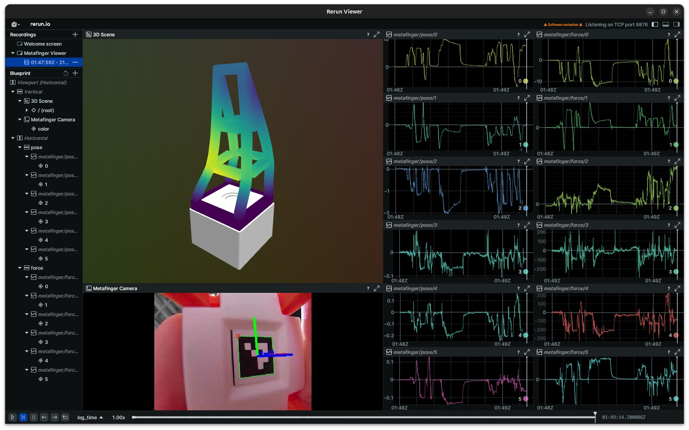

<h1 align="center">MetaFinger Viewer</h1>

<p align="center">
  <a href="https://www.python.org/"></a>
  <a href="https://rerun.io/"></a>
  <a href="https://opencv.org/"></a>
  <a href="LICENSE"></a>
</p>

This is a viewer example for the [MetaFinger](https://github.com/han-xudong/metafinger). The viewer visualizes streams of multimodal data, including 3D scene of mesh, captured image, detected pose of marker, and estimated force.



## 📦 Installation

Clone the latest repository:

```bash
git clone https://github.com/han-xudong/metafinger-viewer.git
```

We use `uv` to manage Python dependencies. See [uv documentation](https://docs.astral.sh/uv/getting-started/installation/) for installation instructions. Once `uv` is installed, run the following command to set up the environment:

```bash
uv sync
uv pip install -e .
```

## 🚀 Quick Start

Run the viewer with the following command:

```bash
uv run metafinger-viewer [options]
```

Various configuration options are available:

| Options       | Description                                   | Type   | Default      |
|---------------|-----------------------------------------------|--------|--------------|
| --mode        | Viewer mode: 'live' or 'replay'.              | str    | live         |
| --host        | Host address for the data subscriber.         | str    | 127.0.0.1    |
| --port        | Port number for the data subscriber.          | int    | 6666         |
| --data-path   | Path to the data folder for replay mode.      | str    | None         |

When the data of the MetaFinger is available, the viewer will show the streams of the data.

## 📄 License

This project is licensed under the MIT License (see [LICENSE](LICENSE) for details).
